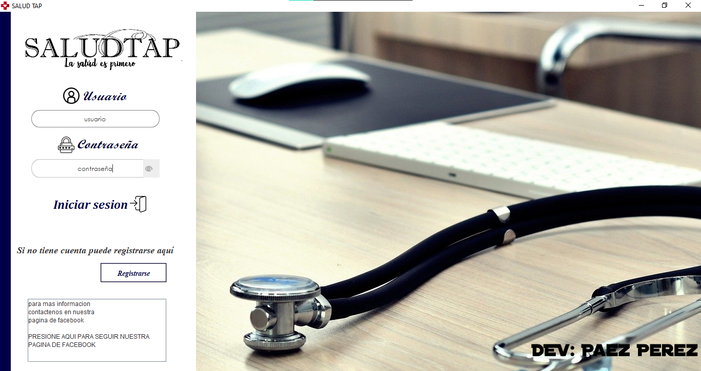

# Salud-tap-Terminado
#### sistema creado para la materia de interfaces donde se crea un sistema para poder sacar cita, consultar lista y borrar citas con una base de datos realizadas en POSTGRESQL

```java


            if (conec.rs.next()) {
                this.dispose();
           framePrincipal.LabelNombre.setText("Bienvenido " + conec.rs.getString("nombre")+" "+conec.rs.getString("apellido_paterno"));
                framePrincipal.txtNombre.setText("" + conec.rs.getString("nombre"));
                framePrincipal.txtApellido.setText("" + conec.rs.getString("apellido_paterno"));
                framePrincipal.txtApellidoM.setText("" + conec.rs.getString("apellido_materno"));
                framePrincipal.txtEdad.setText("" + conec.rs.getString("edad"));
                framePrincipal.txtCurp.setText("" + conec.rs.getString("curp"));
                framePrincipal.txtUsuario.setText("" + conec.rs.getString("usuario"));
                framePrincipal.txtPassword.setText("" + conec.rs.getString("password"));
                framePrincipal.laID.setText("" + conec.rs.getString("id"));
                
                framePrincipal.setVisible(true);
                
                
                
   ```
   
   
   
  
